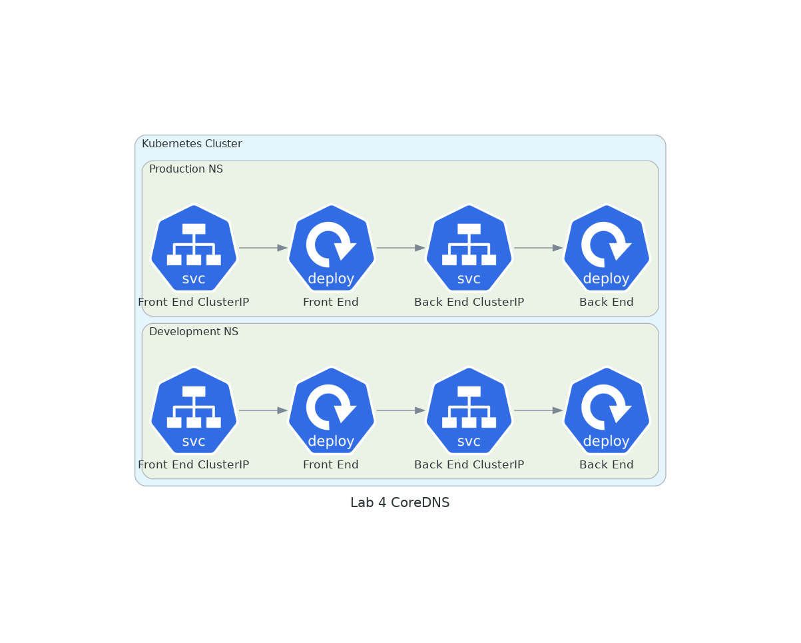
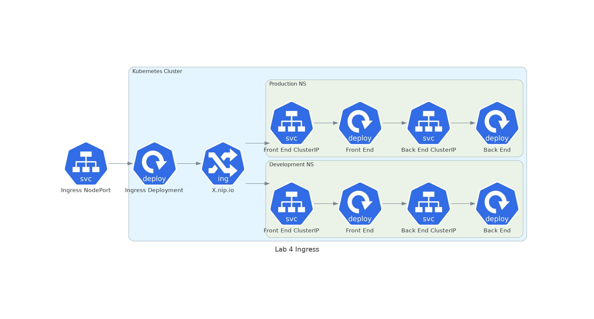

# Lab 4 - Networking
## 4.1 Explore CoreDNS

1. Create a `public.ecr.aws/qa-wfl/qa-wfl/qakf/sbe` deployment in each of the `dev` and `prod` namespaces, using the `:v2` image in `dev` and the `:v1` image in `production`.

<details><summary>show commands</summary>
<p>

```bash
kubectl create deploy lab4backend --image=public.ecr.aws/qa-wfl/qa-wfl/qakf/sbe:v1 -n production 
kubectl create deploy lab4backend --image=public.ecr.aws/qa-wfl/qa-wfl/qakf/sbe:v2 -n development
```

</p>
</details>
<br/>

2. Expose them both as `clusterIP` services on `port` 80 with a `target-port` of 8080, giving them both a `name` of `backend`.

<details><summary>show commands</summary>
<p>

```bash
kubectl expose deployment lab4backend --port 80 --target-port 8080 --name backend --namespace production 
kubectl expose deployment lab4backend --port 80 --target-port 8080 --name backend -n development
```

</p>
</details>
<br/>

3. We're going to use the `busybox` image to interact with DNS using nslookups. Create a pod named `nettools` in both the `dev` and `prod` namespaces. Use the `busybox` image. You'll need it to run a `command` of `sleep infinity` or it will immediately transition to a `completed` state.

<details><summary>show commands</summary>
<p>

```bash
kubectl run nettools --image=busybox -n production --command sleep infinity
kubectl run nettools --image=busybox -n development --command sleep infinity
```

</p>
</details>
<br/>

4. Use `kubectl exec` to execute the command `nslookup backend` on the two pods in the two different namespaces.

<details><summary>show commands</summary>
<p>

```bash
kubectl exec -it nettools -n production -- nslookup backend
kubectl exec -it nettools -n development -- nslookup backend
```

</p>
</details>
<br/>


Example output:

```
Server:         10.96.0.10
Address:        10.96.0.10:53

** server can't find backend.cluster.local: NXDOMAIN

Name:   backend.development.svc.cluster.local
Address: 10.107.29.209

** server can't find backend.svc.cluster.local: NXDOMAIN

** server can't find backend.cluster.local: NXDOMAIN


** server can't find backend.svc.cluster.local: NXDOMAIN

command terminated with exit code 1
```
<br/>

Note that CoreDNS tried a lot of variations of the name `backend` but one of the first was for `backend.development.svc.clsuter.local` in this case. When run against the prod namespace, it'll look there. This is to illustrate that CoreDNS "knows" which namespace a pod is running in and returns the appropriate lookup.

5. There's only one placeholder remaining in our simple front end application, for the data from the backing service. Let's finish that off now by `apply`ing (a copy of) the sfe deployment in both namespaces. Again, you might wish to change the `lab3frontend`s to `lab4frontend`s or simply `frontend`s.

<details><summary>show command</summary>
<p>

```bash
kubectl apply -n production -f lab4frontend.yaml
kubectl apply -n development -f lab4frontend.yaml
```

</p>
</details>
<br/>

6. Get the new pods' details either from the dev or the prod namespaces. It doesn't matter which. Ask for `wide` output so you can see their IP addresses.

<details><summary>show command</summary>
<p>

```bash
kubectl -n production get pods --output wide
```

</p>
</details>
<br/>

Example output (modified):

```
NAME                          READY   STATUS    RESTARTS   AGE   IP               NODE
frontend-5b6dcf74cb-kvvvn     1/1     Running   0          14m   192.168.29.154   k8s-worker-0   lab4backend-676f7c57f-26cjm   1/1     Running   0          78m   192.168.230.25   k8s-worker-1   nettools                      1/1     Running   0          7m    192.168.230.30   k8s-worker-1
```

<br/>

7. **cURL** one of the frontend pods' IP addresses. You should see a v2 message in the dev namespace and a v1 message in production.

8. **Optional but maybe interesting** `exec` into one of your frontend pods and run `cat /code/app/main.py`. See (around the 25th line) it's just asking for "http://backend"? That's basically what you did earlier with the nslookups. CoreDNS still knows which namespace your workload is running in. And the lack of a port number is why we had to have the service listening on port 80 but forwarding to 8080 (which the app is listening on).

## 4.2 Install an ingress controller



Because we've exposed the back- and front-end services as `clusterIP`s, we can't currently reach them from "outside" the cluster (the host machine). That's fine for the backend services, but the frontend needs to be reachable. If we were running in a cloud, we could expose the two frontends with two load balancer services, or use the cloud vendor's ingress controller. We'll use a couple of ingress rules behind a single Nginx ingress controller.

9. Run the following command to install an Nginx Ingress Controller. A whole bunch of resources will be created. Helm is a package manager for Kubernetes, which we haven't covered yet, but we will, in the very next module.

```bash
helm install ingress-nginx ingress-nginx \
  --repo https://kubernetes.github.io/ingress-nginx \
  --namespace ingress-nginx --create-namespace
```

10. Check that the ingress service is running. Get a list of all services in all namespaces.

<details><summary>show command</summary>
<p>

```bash
kubectl get services --all-namespaces
```

</p>
</details>
<br/>

Example output (modified):

```
NAMESPACE       NAME                                 TYPE           CLUSTER-IP       EXTERNAL-IP   PORT(S)                      AGE
development     backend                              ClusterIP      10.102.60.108    <none>        80/TCP                       14m
production      backend                              ClusterIP      10.105.142.21    <none>        80/TCP                       19m
ingress-nginx   ingress-nginx-controller             LoadBalancer   10.107.57.60     <pending>     80:31886/TCP,443:30765/TCP   72s
ingress-nginx   ingress-nginx-controller-admission   ClusterIP      10.104.181.164   <none>        443/TCP                      72s
```

<br/>

11. Make a note of the nodePort number of the `ingress-nginx-controller` service. Browse to yourIp:nodePort. On the standard build for this course, that's 172.17.1.10 but you could use `hostname -i` to check. You should get a 404 File Not Found error because we haven't configured any backends. That's ingress backends, not our simple backend service, and we're going to sort that out now.

## 4.3 Expose the frontends

12. Expose both of the frontends in the two different namespaces. Expose them both as `clusterIP` services on `port` 80 with a `target-port` of 8080, giving them both a `name` of `frontend`.

<details><summary>show commands</summary>
<p>

```bash
kubectl expose deployment lab4frontend --port 80 --target-port 8080 --name frontend --namespace production 
kubectl expose deployment lab4frontend --port 80 --target-port 8080 --name frontend -n development
```

</p>
</details>
<br/>

13. Check that you can reach them both by finding their IP addresses and **cURL**ing them.

<details><summary>show command</summary>
<p>

```bash
kubectl get svc -A
curl dev-frontend-service-ip
curl prod-frontend-service-ip
```

</p>
</details>
<br/>

14. Create an ingress rule for the dev frontend using nip.io in the dev namespace. You might want to call the file `devingress.yaml`.

<details><summary>show command</summary>
<p>

devingress.yaml:

```yaml
apiVersion: networking.k8s.io/v1
kind: Ingress
metadata:
  name: dev-ingress
  namespace: development
spec:
  ingressClassName: nginx
  rules:
  - host: dev.172.17.1.10.nip.io # make sure this IP address matches your node's IP address
    http:
      paths:
      - path: /
        pathType: ImplementationSpecific
        backend:
          service:
            name: frontend
            port:
              number: 80
```

</p>
</details>
<br/>

15. Create the ingress.

<details><summary>show command</summary>
<p>

```bash
kubectl create -f devingress.yaml
```

</p>
</details>
<br/>

16. Point your web browser at *dev*.**your-ip***.nip.io*:**ingress-nodePort**, for example in this instance it's `dev.172.17.1.10.nip.io:31886` 

17. Create another ingress for the production namespace. It will be very similar to the devingress.yaml, but you need to make sure you change all the bits that need to change.

<details><summary>show command</summary>
<p>

prodingress.yaml:

```yaml
apiVersion: networking.k8s.io/v1
kind: Ingress
metadata:
  name: prod-ingress    #change this from dev
  namespace: production #change this from dev
spec:
  ingressClassName: nginx
  rules:
  - host: prod.172.17.1.10.nip.io #change this from dev
    http:
      paths:
      - path: /
        pathType: ImplementationSpecific
        backend:
          service:
            name: frontend
            port:
              number: 80
```

</p>
</details>
<br/>

18. Apply and test the prodingress.yaml file, similar to steps 15 and 16 above (just replace "prod" with "dev" in those commands).

<details><summary>Stretch goal - optional exercise</summary>
<p>

19. **Optional stretch goal** create the backend deployment and service, the frontend deployment and service and an ingress in the `test` namespace as well. You might want to change the backend deployment's image versions to dev:v3, test:v2 and prod:v1 (because there's a reason we created three of them!)

</p>
</details>
<br/>

20. That's it, you're done! Let your instructor know that you've finished the lab.